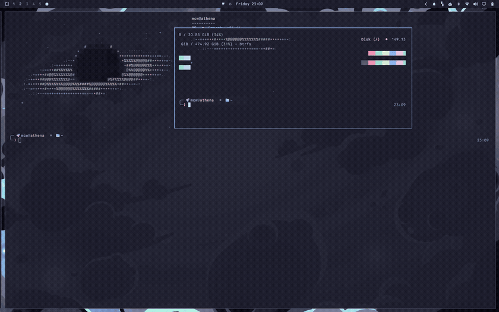

# Reprise



Workspace scenes for Omarchy. Save the stage; restore it with one key.
Apps launch and fly into their places — workspace by workspace, floats
back at their exact spots.

Hyprland has no session management. Reprise is the missing curtain call:
name the layout you are in, and any time later — after a reboot, after a
"close everything" sweep — bring the whole arrangement back.

## Install

```
omarchy plugin add https://github.com/mwaltzer/omarchy-reprise.git --enable
```

Add the Reprise widget to your bar from the shell's widget settings, or
bind a key (see below). Dependencies: only what Omarchy already ships —
`hyprctl`, `sh`, and the system `python3` (used once per save to read
launch commands from `/proc`).

## Remove

```
omarchy plugin remove io.github.mwaltzer.reprise
```

Your saved scenes live in `~/.config/omarchy/reprise/scenes/` and are
left in place; delete that folder too if you want nothing behind.
Reprise never writes outside its plugin directory and that scenes folder.

## Use

- Open the picker (bar icon or your keybind). Enter restores the selected
  scene: windows that are already running are adopted and moved into
  place; missing apps are launched, then adopted into position as their
  windows appear — in passes, so slow starters and single-instance apps
  arrive correctly too.
- Press `s`, type a name, press Enter to save the current stage —
  windows, workspaces, and float positions — as a new scene.
- `up/down` or `j/k` select, `r` prefills a scene name to re-save,
  `x` twice deletes, `Esc` closes.

Scenes are plain JSON files in `~/.config/omarchy/reprise/scenes/` —
inspect them, edit them, sync them between machines.

Optional keybind in `~/.config/hypr/bindings.lua`:

```lua
o.bind("SUPER + E", "Encore", "omarchy-shell shell toggle io.github.mwaltzer.reprise '{}'")
```

## IPC

```
omarchy-shell reprise list
omarchy-shell reprise save "deep work"
omarchy-shell reprise restore "deep work"
```

Restore from a boot script, a cron, or another machine over SSH.

## Notes and limits

- Launch commands come from `/proc/<pid>/cmdline` at save time, with
  argument boundaries preserved — flags with spaces survive the round trip.
- Chromium web apps are recognized by window class and relaunched through
  `omarchy-launch-webapp`.
- Floating windows come back at their exact position and size; fullscreen
  and pinned states are restored too.
- On the scrolling layout, Reprise reproduces the exact column layout:
  column order, which windows stack in which column, and exact column
  widths. On other layouts (dwindle, master), tiled windows are restored
  to their workspace and tile naturally.
- A relaunched app whose window class changed is still adopted: windows
  that appear during a restore are matched to the remaining slots.
- Scenes restore windows to workspaces; multi-monitor workspace
  assignments follow however your workspaces are bound to monitors.
- A scene's file name is its name reduced to a slug, so names that
  reduce to the same slug ("Tonight!" and "tonight") share one file —
  saving the second overwrites the first.

## Development

The planning logic is pure JavaScript in `Reprise.js`, covered by a
frameworkless test suite:

```
node tests/reprise.test.mjs
```

QML lint: `qmllint -I /usr/share/omarchy/shell *.qml`

MIT licensed.
